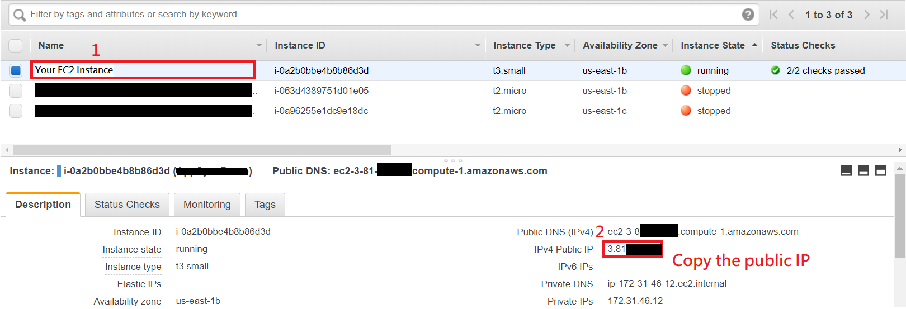
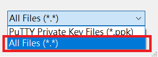
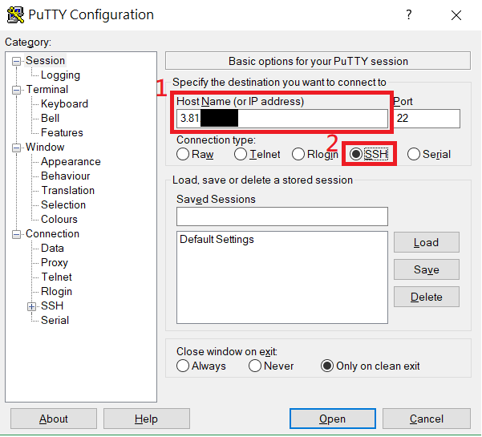
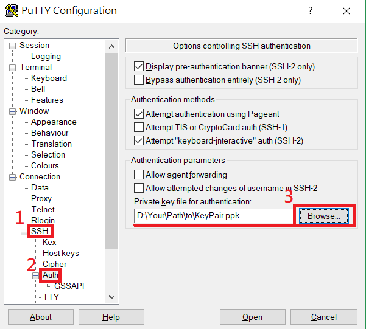
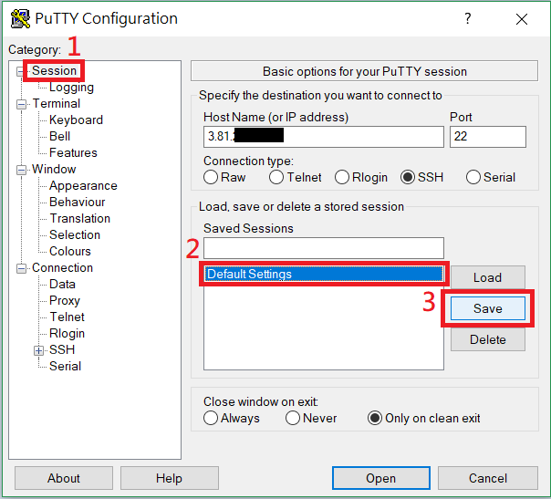
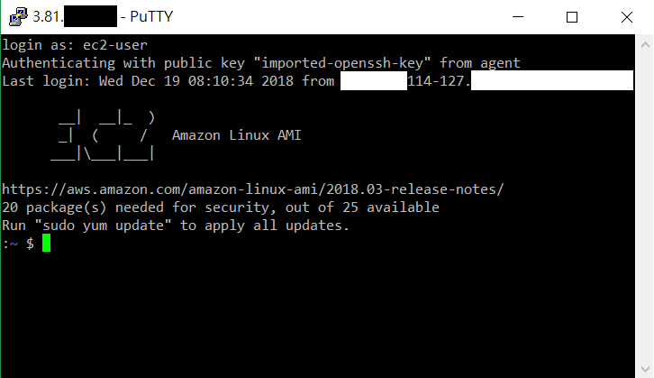

# Connect to EC2 Linux Instance
This brief tutorial provides direct steps for beginners who are not familiar with Information Technology and refers to AWS's [official documentation](https://docs.aws.amazon.com/AWSEC2/latest/UserGuide/AccessingInstances.html). Please feel free to share.

## List of Content

* Get Instance IP
* Start Connecting
  * Use PuTTY to Connect to EC2 Linux Instance (Windows)
  * Use SSH to Connect to EC2 Linux Instance (Linux / macOS)

## 1. Get Instance IP

* Go to [EC2 Management Console](https://console.aws.amazon.com/ec2/v2/home?region=us-east-1#Instances:sort=instanceState).

* Choose the EC2 Instance you want to connect.

* On lower panel, you can see the instance's **IPv4 Public IP**.

* Remember or copy the IP because you will use it later.
  
  

## 2. Start Connecting
### 2.1 Use PuTTY to Connect to EC2 Linux Instance (Windows)

* Download and install PuTTY from [here](https://www.chiark.greenend.org.uk/~sgtatham/putty/latest.html). PuTTY is a free SSH client for Windows which can be used to connect to EC2 instances.

  > It is recommended to install PuTTY via official Windows Installer (the .msi file).

* Before start connecting, we first need to use **puttygen** to convert our key pair file from .pem format to .ppk format since PuTTY requires .ppk format. 

  Execute **puttygen.exe**.

  > puttygen.exe should be installed together if you had installed PuTTY via official Windows Installer. If you can't find puttygen.exe, try to press **`Win + S`** (**`Win + F`** for Win 7) and type **`puttygen`** to search the execution file.

* Click **Load** button and select the **key pair file** which you downloaded while creating instance.

  > Select **`All files (*.*)`** in file browser, otherwise you won't be able to see the original key pair file in .pem format.
  > 

* Click **Save private key** to save in .ppk format.

* Click **Yes** to ignore the warning message.

* Type a name and click **Save**.

* Execute **putty.exe**.

* In the blank of **Host Name(or IP address)**, paste or type the instance's public IP and select **SSH** as connection type. 

  

* Double-click **SSH** category on left side to expand.

* Click **Auth** category.

* Click **Browse...** button to import your **.ppk** file.

  

* (Optional) You can save your settings as **Default Settings** so that you don't need to set up next time.
  * Click **Session** category on left side.
  * Click **Default Settings** below.
  * Click **Save** button.
  
  

* Click the **Open** button below to start connecting.

* Click **Yes** to ignore the warning.

* If you see **`login as:`**, it means you have successfully connected to the instance.

* Type **ec2-user** to login.
  > **ec2-user** is the built-in user for most of EC2 Linux instance. If you can't login successfully, please check below:
  > * For Amazon Linux 2 or the Amazon Linux AMI, the user name is ec2-user.
  > * For a Centos AMI, the user name is centos.
  > * For a Debian AMI, the user name is admin or root.
  > * For a Fedora AMI, the user name is ec2-user or fedora.
  > * For a RHEL AMI, the user name is ec2-user or root.
  > * For a SUSE AMI, the user name is ec2-user or root.
  > * For an Ubuntu AMI, the user name is ubuntu.
  > * Otherwise, if ec2-user and root don't work, check with the AMI provider.

  

* If you see the welcome message below, you can start managing your Linux instance.

  

### 2.2 Use SSH to Connect to EC2 Linux Instance (Linux / macOS)

* If you don't have a SSH client yet, please check http://www.openssh.com/. In general, macOS and most Linux distributions have installed SSH client by default.

* Open a **terminal**.

* Change the directories to the location of **your key pair file**.

      cd /path/to/yourKeyPair

* Use the following command to set the permissions of the key pair file.

      chmod 400 yourKeyPair.pem

* Use the following command to start a SSH connection where `EC2_INSTANCE_IP` is the public IP we mentioned in previous one section.
  > Make sure that you have replaced `EC2_INSTANCE_IP` with the public IP of your instance.

  > **`ec2-user`** is the built-in user for most of EC2 Linux instance. If you can't login successfully, please check below and replace **`ec2-user`** with the user name corresponding to your AMI:
  > * For Amazon Linux 2 or the Amazon Linux AMI, the user name is ec2-user.
  > * For a Centos AMI, the user name is centos.
  > * For a Debian AMI, the user name is admin or root.
  > * For a Fedora AMI, the user name is ec2-user or fedora.
  > * For a RHEL AMI, the user name is ec2-user or root.
  > * For a SUSE AMI, the user name is ec2-user or root.
  > * For an Ubuntu AMI, the user name is ubuntu.
  > * Otherwise, if ec2-user and root don't work, check with the AMI provider.

      ssh -i yourKeyPair.pem ec2-user@EC2_INSTANCE_IP

* Enter **yes** when you see the following message.

      The authenticity of host 'xxx.xxx.xxx.xxx (xxx.xxx.xxx.xxx)' can't be established.
      ECDSA key fingerprint is SHA256:H0NHIoNi1helKgCyYxG8pzECQm8tvhQ++xxxxxxxxxx.
      Are you sure you want to continue connecting (yes/no)? yes

* Start managing your instance after displaying welcome message.

      Warning: Permanently added 'xxx.xxx.xxx.xxx' (ECDSA) to the list of known hosts.
      Last login: Wed Dec 19 08:11:46 2018 from xxx-xxx-114-127

            __|  __|_  )
            _|  (     /   Amazon Linux AMI
            ___|\___|___|

      https://aws.amazon.com/amazon-linux-ami/2018.03-release-notes/
      20 package(s) needed for security, out of 25 available
      Run "sudo yum update" to apply all updates.
      :~ $
